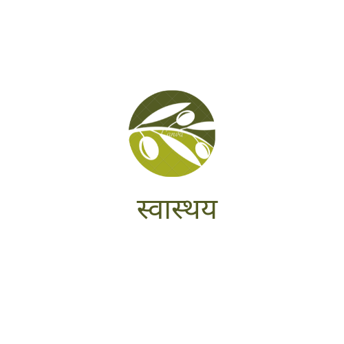
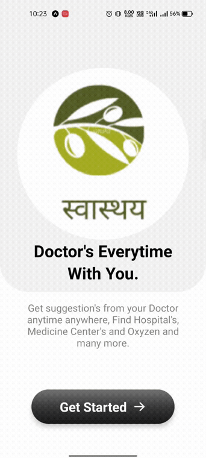
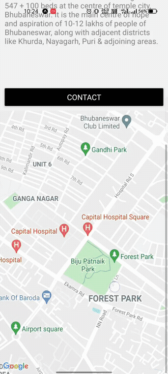
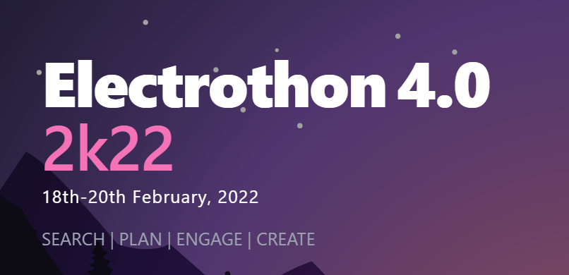

<h1 align='center'>Svaasthy</h1>

<h3 align="center"><a href="https://www.youtube.com/watch?v=hwGg92Yojrg">View the presentaton</a></h3>

<h2>The problems we address... </h2>

  
The covid-19 crisis is drawing attention to the already overburdened public health systems in many countries, and the challenges faced in recruiting, deploying, retaining and protecting sufficient well-trained health workers. Social dialogue is essential to building resilient health systems, and therefore has a critical role both in crisis response and in building a future that is prepared for health emergencies. 
Hence, our application provides a shortcut by connecting you with the hospitals and the doctors nearby and making it an ease for you to either consult the doctor, either way (offline/online). 

<h2>How it looks:star_struck: </h2>

<strong>Intro & Login Screen</strong>

<strong>Location & Covid Data Screen</strong>

<strong>Home Screen</strong>

<strong>Setting Screen</strong>

## How we built it 🧠💻
We used React.js in the frontend and Node.js in the backend and MongoDB as our database. We have used Lottie animation and Framer motion for some components like buttons and illustrations for our website. We have created an API using Express and this API fetches data from our database in the backend for contents in the blogs section. Heroku app is used for hosting the backend. We have used Mongoose which connects our database to Express. We have used firebase for hosting the frontend and then we have connected it to our custom domain.

## Challenges we ran into :slightly_frowning_face:
We faced numerous challenges throughout the journey. First, we have decided to work on VS-Code Live share. But we all were new to it. Sometimes it is the connection issues and sometimes it’s our lack of experience in Live Share feature. It took a lot of time to overcome this issue. 
After this we have faced issues while writing codes for responsive design. Sometimes the components were distorted and moved from their places. It took time to place them in their right position. Placing the elements in their position and designing for responsiveness was our big challenge.
The next challenge which we have faced is domain configuration. This is the first time we are hosting our project on xyz domain. We don’t have any previous experience. We have hosted our project on GitHub pages, but this was completely different. We have to go through the documentation and follow the steps mentioned according to the project. But finally, we all can able to figure this out and did this. Along the process, we all have learned how to configure your project in a custom domain.  

## Our Accomplishments 😎
Out of all the hurdles that we faced during this short period, the one that taught us a greater lesson was – ‘Time Management’. We learnt to deal with a lot of issues and solve them respectively within a short span of time. All those sleepless nights sure did turn out to bear an amazing project containing some wonderful ideas, contributing towards the welfare of the society. Together, we have all tried to give our best to deploy this fully functionable web application the way we had envisioned it. It was all very tiresome, yet worth it. Team Swaasthya is proud of the fact that through this app we will be able to help many people out there who deal with emergency health issues or any kind of medical problems. 

## What we learned 🤓
We are a group of very enthusiastic developers who are open to learning and experimenting with new techs. The thing which is common among us is that we love hackathons 🤩. In this hackathon, we have learnt how to use Firestore database. We have also experienced Google authentication and had our hands-on-experience with Alan AI as well. Altogether, we have learnt a lot of things and aim towards learning and growing more and more.

## Built With :hammer_and_wrench:
 
   
   
   
   
   
     
   

  
 <h2>Team:sunglasses:<h2>
  <table>

 <tr>
    <td align="center">
        
         <b>Kunal Patel</b> 
      
      
      
      <a href="https://instagram.com/kunal_patel.js"></td></a>
</tr>
<tr>
    <td align="center">
        
         <b>Meetabhashini Parida</b> 
      
      
      
      <a href="https://www.instagram.com/_.meetaww._/"></td></a>
</tr>
   <tr>
    <td align="center">
        
         <b>Pavitra Behara</b> 
      
      
      
      <a href="https://instagram.com/pavitra.js"></td></a>
</tr>
 <tr>
    <td align="center">
        
         <b>Ankit Singh</b> 
      
      
      
      <a href="https://instagram.com/ankitsingh0702"></td></a>
</tr>
</table>

<h3 align="center">Made with 💝 by Team Svaasthy .</h3>
